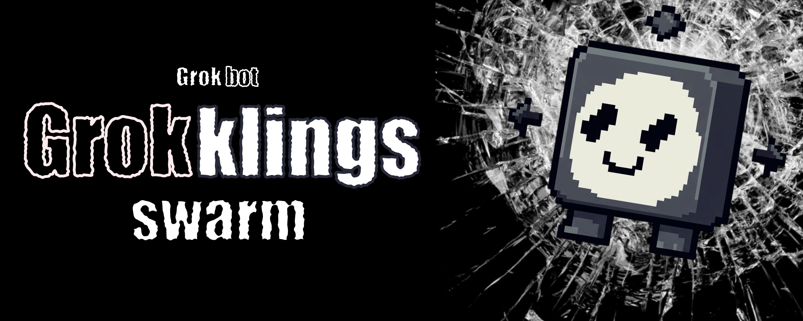

# Grokklings


## There is work that keeps coming back

Not the one-off kind — the kind that returns. Every ticket. Every release.
Every morning. You could write down the steps, but each step needs a
judgement rather than a rule, which is why you are still the one doing it.

Grokklings splits that work into stations. Each station is a **slot** — one
Grok-backed agent with its own instructions and one job. Work travels down
the line, each station adds what it found, and the result lands wherever
you said.

It runs unattended. It does not change itself without your say-so.

*(An independent project built for people running Grok-based agents. Not
affiliated with or endorsed by xAI.)*

### The same machinery, five shapes

Sorting a stream is the obvious one. It is not the boundary:

| shape | what a colony does |
|---|---|
| **triage** | drop the noise, keep and route what matters |
| **enrichment** | extract, then look things up, then reconcile |
| **research** | one question in, several kinds of digging, a composed answer out |
| **production** | draft, then review, then publish — each its own station, graded against your own criteria |
| **watch** | poll on a schedule, decide whether something changed enough to act |

**Where the line actually is.** Three limits worth knowing before you plan
around it. The work has to be task-shaped: it arrives, it goes through, it
ends. A slot cannot stop mid-task, ask you something, and resume — this is
not a chat and not an assistant. And a task never returns to a station it
has already been to: a route is a chain of distinct slots, not a cycle, so
"revise until good" is written as another station rather than a loop back.

Inside those limits it is wide. Anything that fits *"something arrives → a
few steps of judgement → a result lands somewhere"* fits here, and that
turns out to be most work that keeps coming back.

### How a task moves

Every slot a task reaches answers with one of four verdicts:

| the slot says | it means |
|---|---|
| `done` | here is the result, this task is finished |
| `next` | I did my part — send it to *that* slot |
| `not mine` | this isn't my kind of work |
| `failed` | I couldn't, and here is why |

The **dispatcher** listens and lays the route. Slots never call each other,
so no slot has to know what the colony looks like. Ahead of them, **intake**
catches arriving work and drops what it has already seen; at the end an
**output** delivers — a file, a webhook, your terminal.

Every step is written to a **journal**, so afterwards you can ask what
became of any single task and get a real answer.

A slot can be a Python function you wrote, or — the usual case — Grok with
the instructions you gave that slot. Grok is the first-class backend;
Claude works the same way if you would rather think with that.

### Why stations instead of one big prompt

One prompt that screens, digs, decides and writes has a single set of
instructions for four different jobs. When it gets something wrong there is
one place to edit and no way to know which part went wrong.

Split into slots, each part is separately writable, separately scored and
separately replaceable — and the journal says which station the task was
standing at when it went wrong. That is the whole argument.

### What you actually write

A config file naming your slots and what each is for, and — if you want
logic of your own rather than a model's judgement — a Python function per
slot. Everything else is built in and not yours to wire: intake, the
dispatcher, the journal, the stop control, retries, timeouts.

One thing stays yours on purpose. Grokklings does not decide **what counts
as done well** — you write that in your own words in a `[success]` section,
and the colony holds itself to it.

### Installing

Not on PyPI yet, so install it from the repository. Python 3.11+ and
nothing else — the core has no dependencies.

```bash
git clone https://github.com/papa-couch/Grokklings-autonomous-agent-system
cd Grokklings-autonomous-agent-system
pip install -e .
```

That gives you a `grokklings` command. Everything below is written as
`python -m grokklings ...`, which works from anywhere the package is
installed; plain `grokklings ...` is the same thing and shorter.

The optional pieces are extras on the same install, and each section below
names the one it needs:

```bash
pip install -e ".[grok]"        # the Grok backend
pip install -e ".[anthropic]"   # the Claude backend
pip install -e ".[calibrate]"   # checking the judge
pip install -e ".[optimize]"    # tuning a slot's instructions
```

### Quick start

Three commands and a colony is running:

```bash
python -m grokklings init colony.toml                 # writes an example config
python -m grokklings run  -c colony.toml              # bring the colony up
python -m grokklings submit -c colony.toml --json '{"url": "https://example.com"}'
```

The example config needs no key and no network — it runs on a built-in
worker so you can watch a task go through before wiring a model to
anything. Submitting works whether the colony is up or stopped: the queue
lives in the same database as the journal.

Two fuller examples ship with it: `examples/minimal.toml` (no model, no
network) and `examples/watcher.toml` (two model-backed slots, scheduled
polling plus a webhook, different outputs for different results).

<details>
<summary><b>The other twelve commands</b> — each is explained in its own section below</summary>

| command | what it is for |
|---|---|
| `status` | what the colony is doing right now |
| `journal` | the event history |
| `task <id>` | one task's whole fate, step by step |
| `pile` | work nobody took |
| `dashboard` | all of the above on one refreshing page |
| `score` | grade finished work against your `[success]` criteria |
| `calibrate` | check that the grader agrees with you |
| `brain` | read the journal and propose roster changes |
| `proposals` | review those proposals, accept or reject |
| `optimize` | search for better instructions for one slot |
| `cost` | what it has spent, and against which limits |
| `export` | the journal in OpenTelemetry's shape |

All of them take `-c colony.toml`.

</details>

### Config

```toml
[colony]
name = "watcher"
db = "colony.db"
max_hops = 10                 # the limit on hops between slots

[intake]
dedup_key = "url"             # a path into the payload, or "@payload" (hash of the whole thing)

[[source]]                    # manual | interval | webhook
name = "hook"
type = "webhook"
port = 8099

[[slot]]
name = "screen"
description = "what it does and what it's good for"
context = """instructions, criteria, thresholds"""
handler = "grokklings.handlers.grok:handle"
timeout = 120
max_instances = 3
can_route_to = ["deep_dive"]
entry = true

[[output]]                    # console | file | webhook
name = "archive"
type = "file"
path = "archive.jsonl"

[routing]                     # optional — see "Letting Grok pick the slot"
model = "grok-4.6"

[scaling]                     # optional — see "Growing and shrinking a slot"
min_instances = 1

[cost]                        # optional — see "Knowing what it costs"
limit = 25.0
```

### Letting Grok pick the slot

Most of the time the route is already settled: a worker named the next slot,
or there's a single entry slot. Two cases used to have no answer — a task
arriving when several slots could take it, and a worker returning
`not_mine`, which dead-ended on the unplaced pile.

Add a `[routing]` section and Grok decides both, judging by what each slot's
`description` says it does:

```toml
[routing]
model = "grok-4.6"
# router = "my_package:MyRouter"    # anything with async pick(task, candidates)
```

With it, several slots may be marked `entry = true` — the router picks
between them. And a `not_mine` verdict is offered to the slots the task
hasn't visited yet, instead of ending there. The router either names one of
the candidates or says none fit; a name that isn't on the list is refused,
not obeyed. Hop limits and the revisit guard apply exactly as they do to an
explicit handoff.

It's asked only when the answer isn't already determined — a colony with one
entry slot never pays for a call. **Without a `[routing]` section nothing
changes:** the entry slot takes new tasks, `not_mine` goes to the pile, and
the colony runs with no key and no network.

### Growing and shrinking a slot

Without a `[scaling]` section, `max_instances` is the whole story: a slot
gets that many instances at startup and keeps them. Add one and it becomes
a ceiling instead — the slot starts small and grows when work actually
piles up.

```toml
[scaling]
min_instances = 1        # what a slot idles at
queue_per_instance = 3   # backlog per instance that justifies another
grow_after = 10.0        # seconds the pressure must hold
shrink_after = 60.0      # seconds idle before giving one back
```

**The hold times are the point.** Queue depth is spiky; a rule that reacts
to the current value spawns on a burst, collapses on the lull a second
later, and churns instances instead of draining work. So pressure has to
persist before anything spawns, and the clock resets the moment it lets up.
Growing waits 10 seconds and shrinking 60 — being slow to grow costs
latency, being slow to shrink costs nothing.

It moves one instance at a time in either direction, and every decision is
journalled with the backlog that caused it.

### Saying what counts as success

The colony doesn't decide whether it did well — you do. Success is
individual: the same finished task is a good result for one person and
useless to another, and no metric built into the colony can know which. So
you write it down, in your own words, and the colony applies it:

```toml
[success]
looking_for = "what you're after at all"
counts_as   = "what a good result looks like"
never       = "what must never happen, whatever the score"
```

A slot may add its own `success = "..."` for what a good result from that
slot looks like. It's read only when scoring — the worker never sees it.

```bash
python -m grokklings score -c colony.toml       # score finished tasks
```

Each task gets a score from 0 to 1, whether it met your bar, and feedback
specific enough to act on. **A crossed red line is reported separately, not
folded into the score** — work can be excellent at what it was asked to do
and still do something you said must never happen; the command exits
non-zero when that happens.

Scoring never runs inside the pipeline, so a task's fate doesn't depend on
being judged. A task that couldn't be scored records nothing rather than a
zero, and the next pass picks it up. **Without a `[success]` section
nothing is scored at all.**

### Checking the judge

Scoring gives you numbers. Nothing so far says the numbers mean what you
meant — and a judge that's quietly off produces confident scores that look
exactly like accurate ones. Since the brain builds its proposals on them,
it's worth knowing.

```bash
pip install -e ".[calibrate]"
python -m grokklings calibrate -c colony.toml --export sheet.jsonl -n 30
# fill in each line's "label" with your own score, 0 to 1
python -m grokklings calibrate -c colony.toml --labels sheet.jsonl
```

```
judge's own average:  0.673
calibrated against you: 0.490   (95% CI 0.415–0.566)
drift: +0.183   — the judge scores higher than you
```

Under it is [CJE](https://github.com/cimo-labs/cje), which fits a judge→you
mapping on what you labeled and re-estimates over everything, with an
interval. When too much of the judge's range falls outside what you
labeled, it says so and refuses to stand behind the number rather than
quietly reporting one.

Two things about the worksheet are deliberate. **It doesn't show you the
judge's score** — seeing it is how you end up agreeing with it. **The
sample is random**, not the cases that look wrong; labeling only your
suspicions measures the judge on its worst day.

Somebody has to judge thirty tasks by hand. That's the cost of knowing, and
nothing removes it.

### The brain: growth you agree to

Once the colony has been running, something else becomes possible: noticing
that the roster itself is wrong. Work keeps arriving that nobody takes. One
slot is doing two jobs. A context is producing results that don't meet your
bar.

```bash
python -m grokklings brain      -c colony.toml    # read what happened, propose
python -m grokklings proposals  -c colony.toml    # see what's waiting
python -m grokklings proposals  -c colony.toml --accept 42
```

Each proposal says what it would change, why, and which tasks it's based
on. A proposal that cites no evidence never reaches you.

**The brain proposes and nothing else.** Nothing in the colony reads
proposals — the dispatcher and the slots don't know they exist. Accepting
one prints the TOML to put in your config; the brain never edits it. What
the colony runs stays something you typed, which also makes rolling back a
change deleting lines you can see.

After a change has been running, `payoff` compares that slot's scores
before and after — and says "not enough yet" rather than giving you a
verdict from two tasks.

#### Optimizing a slot's instructions

The brain writes a replacement context in one pass — a guess informed by
the evidence. [GEPA](https://github.com/gepa-ai/gepa) does the other thing:
proposes a change, runs it, scores it against your criteria, reads *why* it
scored that way, and proposes again, keeping what survives.

```bash
pip install -e ".[optimize]"
python -m grokklings optimize -c colony.toml --slot triage --budget 60
```

It comes back as a proposal like any other — nothing is applied until you
accept it, and accepting prints text for you to paste.

**Two warnings worth reading before you spend money.** Each run in the
budget costs a worker call plus a judging call, so `--budget 60` is 120
model calls. And GEPA optimizes toward whatever your judge rewards: if the
judge is off, the search will faithfully drive your instructions toward its
bias and the result will score wonderfully. **Calibrate first.**

### Watching it work

One page with everything above on it, refreshing itself:

```bash
python -m grokklings dashboard -c colony.toml
# dashboard on http://127.0.0.1:8100 — read-only, Ctrl-C to stop
```

Tasks by status, what each slot is working on and what's waiting for it,
spend against your limit, average score, proposals the brain is waiting on,
the unplaced pile, and the last forty journal events.

**It cannot change anything.** The handler implements `do_GET` and no other
method, so a POST is refused by Python's own HTTP server. That's a
different guarantee from "there are no buttons yet": accepting a proposal
or lifting a cost limit from a browser would turn consent and the spend
stop into questions about who can reach a port. Both would be reasonable
features; neither is a reasonable side effect of adding a page.

It reads the database from outside — it can't slow the colony down, and it
works on a stopped one. It binds to loopback, because the journal holds
whatever your sources fed in; `--host` will bind elsewhere and say so.

No dependency: stdlib `http.server`, one self-contained page.

### Knowing what it costs

Every model call already writes its token usage to the journal. The rates
come from litellm's maintained price table — one JSON file, pinned locally
so nothing phones out mid-run:

```bash
python -m grokklings cost -c colony.toml --refresh   # pin the price table
python -m grokklings cost -c colony.toml
```

```
$4.2000 over 5 model call(s)
$4.2000 in the last 24 hours

by model:
  $    3.2000  grok-4.6
  $    1.0000  claude-opus-5
```

Add limits and the totals become a stop:

```toml
[cost]
limit = 25.0          # total, since the journal began
daily_limit = 5.00    # over a rolling 24 hours
```

Crossing one **pauses** the colony — no new tasks taken, in-flight ones
seen through. That's the same stop control `Ctrl-C` uses; nothing is
killed. A limit set with no pinned price table refuses to start, because a
limit that silently isn't enforced is worse than no limit.

**A model with no price is counted as unknown, not as free.** This matters
more than it sounds: treating a missing rate as zero would have the colony
report spending nothing while spending steadily, and the limit would never
fire. Instead the unpriced calls are named, the command exits non-zero, and
**a limit is not enforced while the total is known to be incomplete** —
which does mean a runaway unpriced model isn't stopped. It's said loudly on
every check rather than hidden.

Nothing new to install: `urllib` fetches the table, `json` reads it.

### Feeding a dashboard

The journal keeps its own vocabulary — `task_unplaced`, `task_looped`,
`step_replayed` say things no standard has a word for. But the events that
*do* have a standard equivalent can be spoken in it:

```bash
python -m grokklings export -c colony.toml --out spans.jsonl
```

```
4 of 8 event(s) speak the convention; 4 are ours alone and stay in the journal.
```

Five of our events translate onto the [OpenTelemetry GenAI
convention](https://github.com/open-telemetry/semantic-conventions-genai) —
an assignment becomes `invoke_agent`, a model call becomes `chat` carrying
`gen_ai.usage.*`, a spawned clone becomes `create_agent`. Everything else
stays ours and isn't exported, which the command tells you rather than
hiding.

**Nothing was renamed.** Journals already on disk are unaffected, and the
convention is still at Development status — when its names change, one file
changes and no stored data does.

The output is OTLP-*shaped* JSON lines: no collector, no protobuf. Enough
for a dashboard's importer, not a substitute for one.

### Writing your own worker

A worker is a function (regular or a coroutine) that gets a task and the
slot's context, and returns one of four verdicts. It never calls another
worker: the dispatcher lays the route.

```python
from grokklings import Verdict

def handle(task, ctx):
    if "url" not in task.payload:
        return Verdict.not_mine("I only handle links")
    if is_suspicious(task.payload):
        return Verdict.next("deep_dive", {"flag": "needs a closer look"})
    return Verdict.done({"verdict": "junk"})
```

In the slot's config: `handler = "my_package.module:handle"`. The system
takes care of everything else — timeouts, retries with exponential backoff,
journal entries, returning the task if the instance crashes. `ctx.slot.context`
gives you the slot's context, `ctx.options` gives you the rest of the config's
keys, `task.merged_result()` gives you what prior workers have already
accumulated.

#### Actions that can't happen twice

A retry calls the worker again. If it already sent a notification or charged
a payment and then crashed before returning a verdict, the second pass does
it again. Wrap that part in `ctx.once` — it runs at most once per task's
lifetime, and a repeat gets back the recorded result:

```python
def handle(task, ctx):
    code = ctx.once("notify", send_notification, task.payload)
    return Verdict.done({"code": code})
```

The key (`"notify"`) is yours to pick, and it must stay the same across
attempts. A failed step isn't recorded and honestly retries. For a coroutine,
use `await ctx.once_async(...)`.

This closes the gap between "the step succeeded" and "the verdict was
recorded" — but not the gap inside the call itself: if a service accepted the
request and we crashed before hearing back, there's no way to know. For that
case, pass the service `ctx.idempotency_key("name")` — a key that's the same
across every attempt of one step, so a service that honors it drops the
repeat on its own. The built-in webhook output does exactly that, via the
`Idempotency-Key` header.

Two model-backed workers are already here, sharing one contract: the slot's
description and context become the system prompt, the verdict comes back as
structured output, checked against a schema.

- `grokklings.handlers.grok:handle` — the primary backend, thinks with Grok
  via xAI's API. Needs `pip install -e ".[grok]"` and `XAI_API_KEY`.
- `grokklings.handlers.anthropic:handle` — thinks with Claude via the
  Anthropic API. Needs `pip install -e ".[anthropic]"` and
  `ANTHROPIC_API_KEY`.

Both take the same slot config shape (`options.model`, `options.max_tokens`);
switching between them is a one-line change to `handler`.

### What's guaranteed

- A task never disappears: every outcome is a status and a journal entry.
- Duplicates are dropped with a reference to the first instance; dedup
  survives a restart.
- Results are never overwritten: every worker adds its own.
- A crashed instance, a timeout, and garbage in the response all retry with
  growing backoff; once attempts run out, the task becomes a failure instead
  of vanishing.
- A piece of work wrapped in `ctx.once` survives a retry without repeating:
  the built-in file and webhook outputs never deliver a result twice.
- A worker never gets the same task twice, and the hop counter stops a loop.

### Tests

```bash
python -m unittest discover -s tests -t .
```

That works from a clean checkout with nothing installed — the core needs
only the standard library, and the tests covering the optional extras skip
themselves. To run those too:

```bash
pip install -e ".[dev,calibrate,optimize]"
```

`dev` is both model-backend SDKs. It turns on `tests/test_sdk_contract.py`,
which binds the requests this code sends against the SDKs' real signatures
without calling anything.

CI ([0023](docs/decisions/0023-ci-checks-both-promises.md)) runs both
halves on every push: the bare install across Python 3.11, 3.12 and 3.13,
and the full one — where a *skipped* test fails the build, because a skip
there means a dependency is missing and the test never ran.

### Where to go next

[`docs/`](docs/README.md) — a map of every document in the project. In short:

- [`docs/architecture.md`](docs/architecture.md) — what works, what doesn't,
  where to build next;
- [`docs/plan.md`](docs/plan.md) — phases 1-6 and what to do next;
- [`docs/decisions/`](docs/decisions/) — why things are built the way they
  are, and how to undo it;
- [`docs/open-questions.md`](docs/open-questions.md) — what's still unresolved;
- [`docs/glossary.md`](docs/glossary.md) — the architecture's terms mapped to names in the code.

### License

MIT — see [LICENSE](LICENSE). Use it, change it, ship it inside something
closed and commercial; keep the copyright line, and expect no warranty.
The optional extras are other people's work under their own terms: CJE and
GEPA are MIT, and the price table `grokklings cost` pins is one MIT-licensed
JSON file from litellm, fetched rather than vendored.

Grokklings is an independent project. It isn't affiliated with or endorsed
by xAI.
